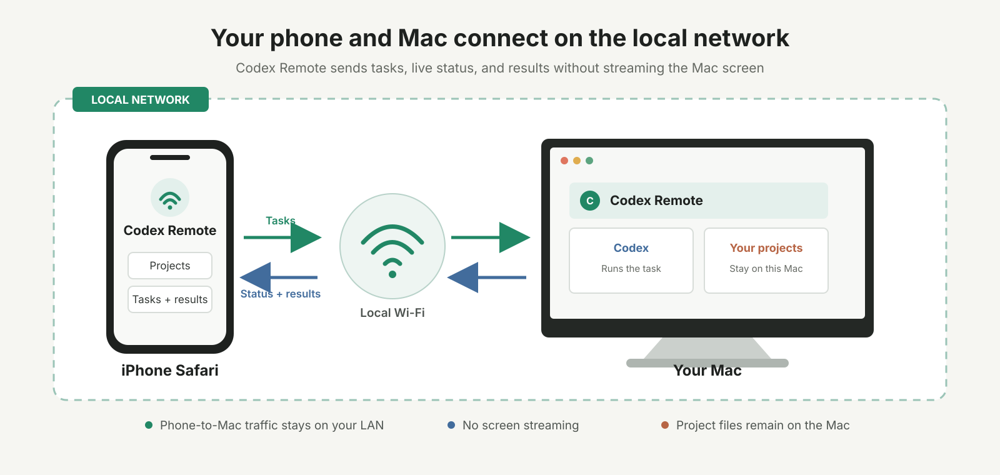
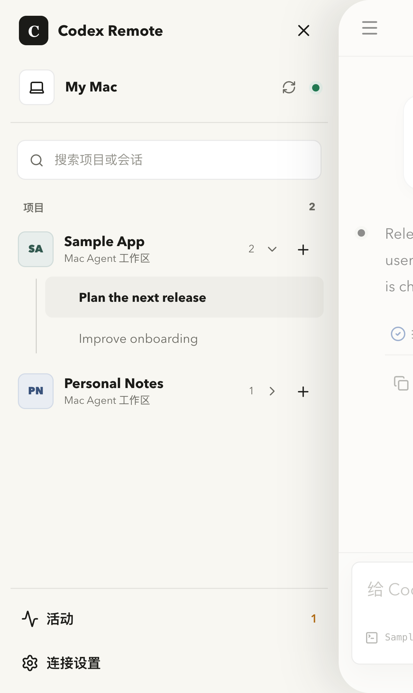
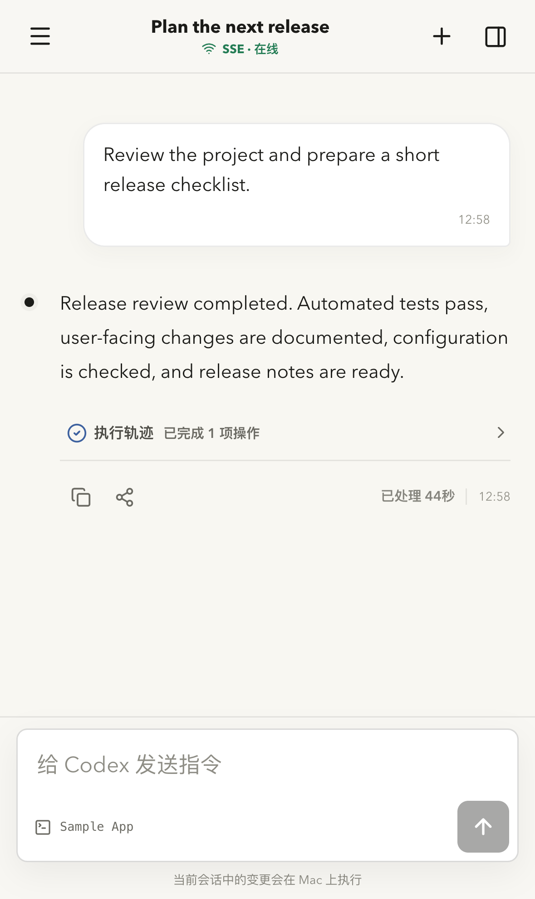

# Codex Remote

[English](README.md)

在手机上继续使用运行于 Mac 的 Codex。

Codex Remote 适合那些不值得一直守在电脑前等待的任务。你可以在 Mac 上开始工作，
然后在同一局域网内通过手机查看进度、发送后续要求或阅读结果。

它不是远程桌面。手机直接使用 Codex 的项目、会话、任务、状态和结果，不会传输整个
Mac 屏幕，也不会控制鼠标和键盘。

## 你可以做什么

- 查看 Mac 上可用的项目和 Codex 会话。
- 从手机发起任务，或继续已有对话。
- 实时查看任务状态并接收结果。
- 让项目文件和 Codex 执行过程始终留在 Mac 上。

## 局域网连接



手机通过本地 Wi-Fi 直接连接 Mac 上的 Codex Remote。它不会传输整个 Mac 屏幕，
项目文件也始终保留在 Mac 上。

## 产品界面

<p align="center">
  
  
</p>

截图使用通用示例项目和任务，不包含任何个人工作区或真实会话数据。

## 快速开始

首个公开版本将支持 Apple Silicon Mac 和 iPhone Safari。开始前，请确认 Mac 已安装
并登录 Codex，并且 Mac 与手机连接在同一局域网。

> [!IMPORTANT]
> Runtime `0.2.0` 已通过本地和真机验收，但目前还不能公开下载。下面是正式版本的
> 预定安装流程，需要等首个完成签名和 Apple 公证的版本发布后才能使用。

### 1. 安装

```bash
brew trust --formula codex-remote/tap/codex-remote
brew install codex-remote/tap/codex-remote
```

### 2. 配置 Mac

指定需要从手机访问的项目所在目录：

```bash
codex-remote setup --workspace-root ~/work
```

Setup 会查找 Codex、准备 Codex Remote 自己的本地数据、选择可用端口并启动后台服务。
它不会修改或停止用户已有的 PostgreSQL、Redis 或 Valkey。

### 3. 配对手机

```bash
codex-remote pair
```

在 iPhone 上打开显示的链接或扫描二维码。配对完成后，选择项目和会话，就可以像在
Mac 上一样发送任务。

## 日常使用

Codex 始终在 Mac 上执行。你可以锁定 Mac 屏幕或离开电脑，再通过手机跟进任务。
Mac 需要保持开机、连接网络，并且能够正常运行 Codex。

需要连接另一台手机或恢复访问时，重新运行 `codex-remote pair`。后续升级使用普通的
Homebrew 命令：

```bash
brew upgrade codex-remote
```

## 隐私与开放范围

项目文件和 Codex 执行过程保留在 Mac 上。Codex Remote 只在局域网内向已配对手机
传递使用所需的项目、会话、任务、状态和结果数据。

应用以签名二进制的形式通过这个公开仓库发布，具体实现源码和内部文档目前暂不公开。
